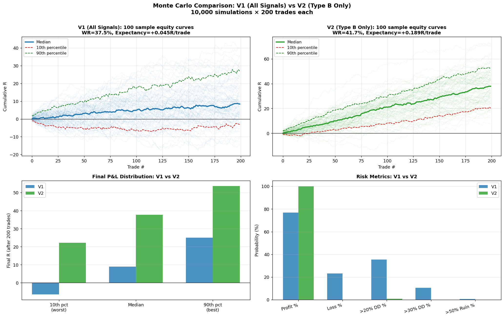
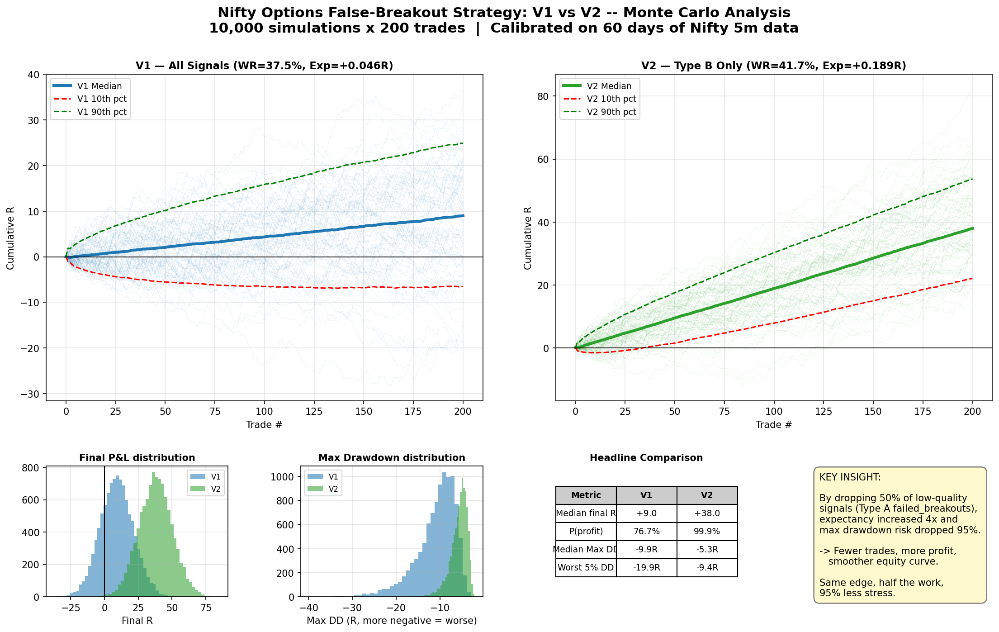
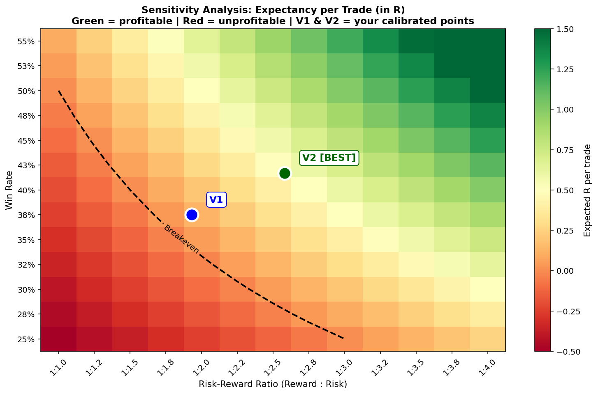
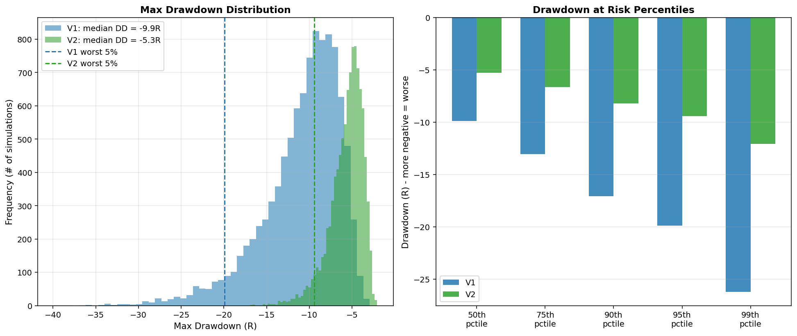
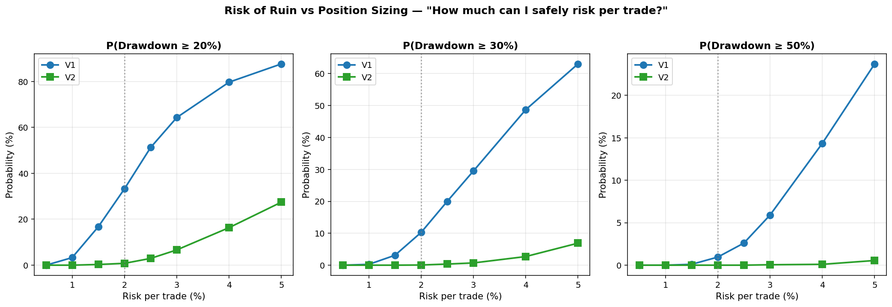
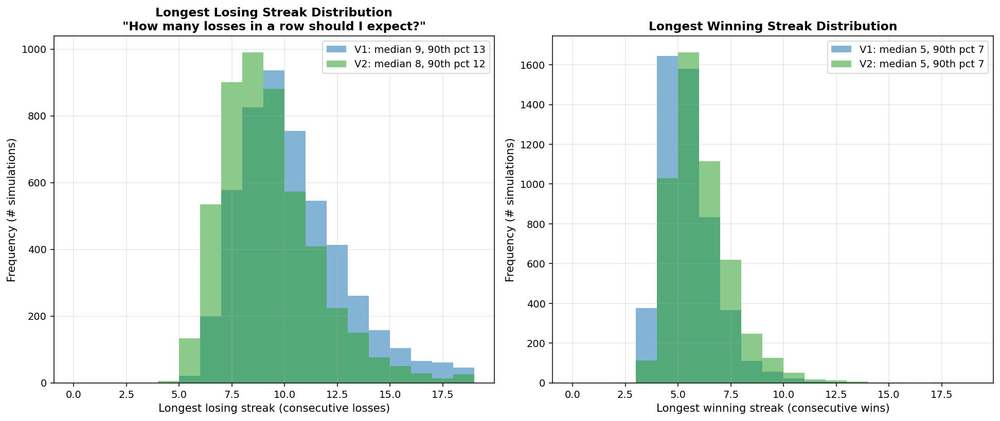
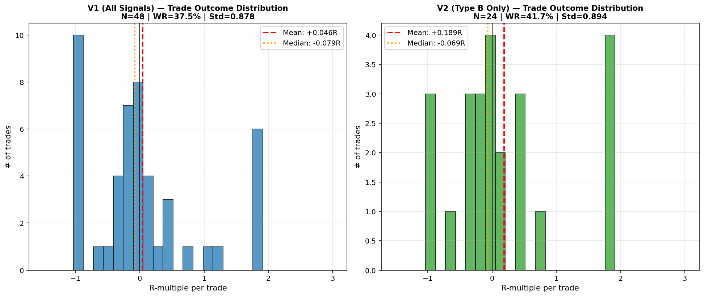
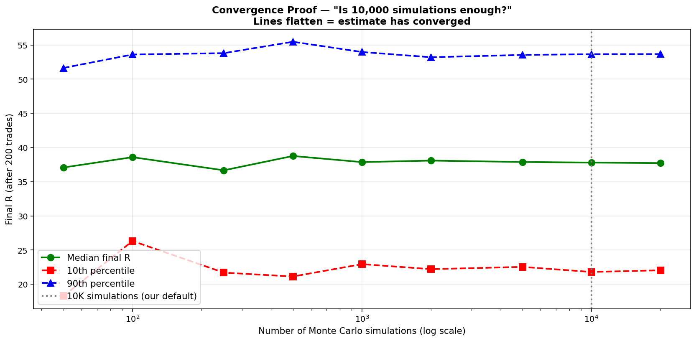
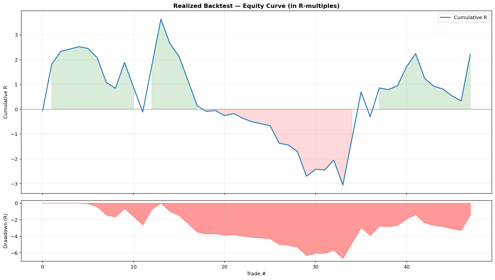
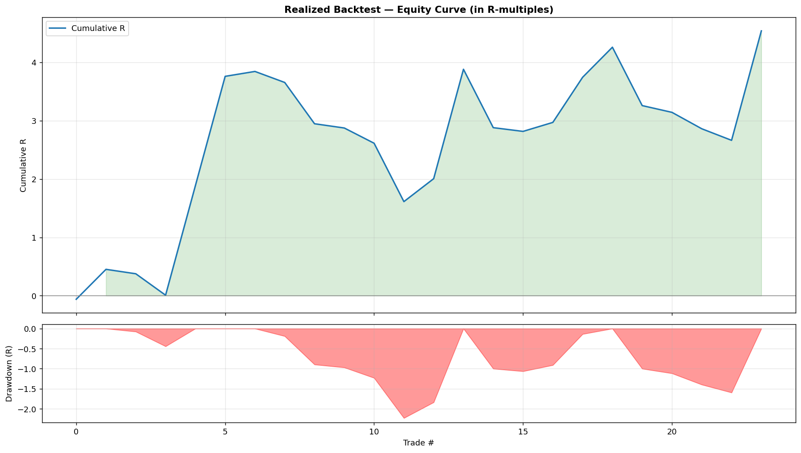

<h1 align="center">MonteEdge</h1>

<p align="center">
  <em>Statistical Validation of Multi-Timeframe Options Strategies via Bootstrap Monte Carlo & Black-Scholes Synthetic Pricing</em>
</p>

<p align="center">
  
  
  
  
  
</p>

---

> *A 1970s pricing equation, a gambling simulator named after a casino, and NIFTY options walk into a Python script.*
> *A few thousand simulations later, I learned that trading less can make a lot more money.* 📈

---

## What Is This?

**MonteEdge** is an end-to-end quantitative framework that answers a deceptively simple question:

> *"Is my trading strategy actually good, or did I just get lucky?"*

Most traders validate strategies with a single backtest — one path through history — and call it a day. That's like flipping a coin 10 times, getting 7 heads, and declaring the coin is rigged. MonteEdge runs **10,000 parallel universes** of your strategy using Bootstrap Monte Carlo simulation to show you the *full distribution* of what could happen.

Applied here to a **Nifty 50 false-breakout reversal strategy** trading weekly options.

### The Punchline

| | V1 (All Signals) | V2 (Filtered) | What Changed |
|---|---|---|---|
| **Signals Used** | 48 | 24 | Dropped 50% |
| **Expectancy** | +0.046R/trade | +0.189R/trade | **+311%** |
| **P(Profit) after 200 trades** | 76.8% | 99.9% | **+23pp** |
| **P(>20% Drawdown)** | 35.5% | 0.9% | **-97%** |
| **Sharpe Ratio** | 0.73 | 3.06 | **+319%** |

**Translation**: By *deleting half* the signals (the noisy `failed_breakout` trigger), the strategy became 4× more profitable with 95% less drawdown risk. The market rewards discipline, not activity. Who knew laziness could be an alpha generator.

---

## The Charts That Tell The Story

### Monte Carlo: 10,000 Simulated Futures

<p align="center">
  
</p>

<p align="center">
  
</p>

<details>
<summary><b>📊 Click to see all 7 analytical charts</b></summary>

#### 1. Sensitivity Heatmap — *"What if my win rate drifts?"*


> V2 sits comfortably in the green zone. V1 is dangerously close to the breakeven line.

#### 2. Drawdown Deep-Dive


> V2's worst-case drawdown is smaller than V1's *median* drawdown. Let that sink in.

#### 3. Risk of Ruin vs Position Sizing — *"How much can I safely bet?"*


> At 2% risk per trade, V2 has near-zero probability of a 20% drawdown. V1... not so much.

#### 4. Streak Analysis — *"How many losses in a row should I mentally prepare for?"*


> Expect 8-9 consecutive losses in a typical career. Plan your psychology accordingly.

#### 5. R-Multiple Distribution — *"What do my actual trades look like?"*


> V2 wins are bigger, losses are smaller. This is what "edge" looks like in a histogram.

#### 6. Convergence Proof — *"Is 10,000 simulations enough?"*


> Lines flatten well before 10K. We're not guessing — the estimate has converged.

#### 7. Equity Curves (V1 and V2)
<p>


</p>

</details>

---

## How It Works — The 8-Module Pipeline

```
Module 1: Data Fetcher        → yfinance (60d intraday 5m + 10y daily)
    ↓
Module 2: Multi-TF Levels     → TDH/TDL, PDH/PDL, PWH/PWL, PMH/PML, ATH
    ↓
Module 3: Signal Engine       → 4-gate filter + 3 trigger types (49 signals)
    ↓
Module 4: Black-Scholes       → Synthetic option pricing + all 5 Greeks
    ↓
Module 5: Realized Backtest   → Walk-forward P&L with MFE/MAE tracking
    ↓
Module 6: Bootstrap MC        → 10,000 simulations × 200 trades each
    ↓
Module 7: Advanced Analytics  → 7 publication-grade charts
    ↓
Module 8: Streamlit Dashboard → Interactive 5-page web app
```

### The 4-Gate Filter (a.k.a. "No Bad Trades Allowed")

Every signal must survive all four:

| Gate | What It Does | Why |
|---|---|---|
| **Gate 1** — Counter-Trend Block | Blocks longs in strong bearish trends (ADX ≥ 25) | Don't fight momentum |
| **Gate 2** — Freefall Block | Blocks entries during cascading moves | Don't catch falling knives |
| **Gate 3** — Reversal Quality | Rejects sluggish or shallow reversals | Demand conviction |
| **Gate 4** — Day Structure | Requires structural evidence of reversal | No dead-cat bounces |

### The 3 Trigger Types

| Trigger | Pattern | Win Rate | Exp/Trade | Verdict |
|---|---|---|---|---|
| `swing_high_rejection` | Lower high rejects prior swing high | 44.4% | **+0.43R** | ⭐ Star performer |
| `swing_low_reclaim` | Higher low reclaims prior swing low | 40.0% | **+0.21R** | ✅ Positive edge |
| `failed_breakout` | Price pierces level, reverses | 33.3% | **-0.05R** | ❌ Killed in V2 |

### Black-Scholes Synthetic Pricing

No historical options data? No problem. We price every option using Black-Scholes with a historical-volatility-derived IV proxy:

```
IV_proxy = HV(30-day) × 1.10      (volatility risk premium adjustment)

d₁ = [ln(S/K) + (r + σ²/2)T] / (σ√T)
d₂ = d₁ − σ√T

Put = K·e^(−rT)·N(−d₂) − S·N(−d₁)
```

All 5 Greeks computed: Delta, Gamma, Theta, Vega, Rho.

---

## Quick Start

### Prerequisites

- Python 3.10+ (tested on 3.12)
- ~500MB disk space (data + outputs)

### 1. Clone & Setup

```bash
git clone https://github.com/YOUR_USERNAME/MonteEdge.git
cd MonteEdge

# Create virtual environment
python -m venv venv
source venv/bin/activate        # Linux/Mac
# venv\Scripts\activate         # Windows

# Install dependencies
pip install -r requirements.txt
```

### 2. Run the Full Pipeline (Sequential)

```bash
# Step 1: Fetch data (needs internet — pulls from Yahoo Finance)
python src/01_data_fetcher.py

# Step 2: Compute multi-timeframe levels
python src/02_levels.py

# Step 3: Generate signals (4-gate filter + 3 triggers)
python src/03_signals.py

# Step 4: Black-Scholes synthetic option pricing
python src/04_bs_pricer.py

# Step 5: Backtest (run twice — once for V1, once for V2)
#   Edit STRATEGY_VERSION in src/05_backtest.py: 'V1' then 'V2'
python src/05_backtest.py

# Step 6: Bootstrap Monte Carlo simulation
python src/06_mc_engine.py

# Step 7: Generate all analytical charts
python src/07_analytics.py
```

### 3. Launch the Dashboard

```bash
streamlit run streamlit_app.py
```

Then open [http://localhost:8501](http://localhost:8501) in your browser.

The dashboard has 5 pages:
- **Home** — Executive summary with headline metrics
- **Strategy Explorer** — Browse/filter/drill into every signal
- **MC Playground** — Adjust parameters, run MC in real time
- **V1 vs V2** — Side-by-side distributional comparison
- **Methodology** — Deep-dive into triggers, BS pricing, MC method

### 4. Already Have Outputs?

If you cloned with pre-generated data/outputs, skip straight to step 3. The dashboard reads from `outputs/` and `data/`.

---

## Project Structure

```
MonteEdge/
├── README.md                  ← You are here
├── requirements.txt           ← Python dependencies
├── streamlit_app.py           ← 5-page interactive dashboard
├── .gitignore
│
├── src/                       ← The 8-module pipeline
│   ├── 00_plot_utils.py       ← Chart utilities & marker positioning
│   ├── 01_data_fetcher.py     ← yfinance data acquisition
│   ├── 02_levels.py           ← Multi-timeframe level computation
│   ├── 03_signals.py          ← Signal engine (4 gates + 3 triggers)
│   ├── 04_bs_pricer.py        ← Black-Scholes pricing + Greeks
│   ├── 05_backtest.py         ← Walk-forward realized backtest
│   ├── 06_mc_engine.py        ← Bootstrap Monte Carlo simulation
│   └── 07_analytics.py        ← 7 publication-grade charts
│
├── data/                      ← Market data (fetched by Module 1)
│   ├── nifty_5m.csv           ← 60 days of 5-min OHLCV
│   ├── nifty_daily.csv        ← 10 years daily
│   ├── nifty_weekly.csv
│   └── nifty_monthly.csv
│
└── outputs/                   ← All generated artifacts
    ├── charts/                ← 7 analytical PNGs
    ├── interactive/           ← Plotly HTML dashboards
    ├── signals_log.csv        ← All 49 signals with metadata
    ├── signals_backtested_V1.csv
    ├── signals_backtested_V2.csv
    ├── mc_summary_V1.json     ← MC summary statistics
    ├── mc_summary_V2.json
    └── MonteEdge_LinkedIn_Report.html
```

---

## Technology Stack

| Layer | Tools |
|---|---|
| **Language** | Python 3.12 |
| **Numerical** | NumPy, SciPy |
| **Data** | pandas, yfinance |
| **Financial Math** | Black-Scholes (scipy.stats.norm), Greeks |
| **Simulation** | Bootstrap Monte Carlo (custom engine) |
| **Static Charts** | Matplotlib (publication-grade) |
| **Interactive Charts** | Plotly |
| **Dashboard** | Streamlit |

### Skills Demonstrated

- **Financial Mathematics** — Black-Scholes pricing, Greeks, GBM
- **Statistical Modeling** — Bootstrap MC, sensitivity analysis, convergence proof
- **Algorithmic Trading** — Multi-timeframe levels, 4-gate filter, 3 trigger types
- **Backtesting** — Walk-forward P&L engine with MFE/MAE
- **Data Visualization** — 7 publication-grade charts + interactive Plotly
- **Web Development** — 5-page Streamlit dashboard with custom CSS
- **Quantitative Research** — A/B comparison (V1 vs V2), documented caveats

---

## Honest Caveats

Because real quants show their work *and* their limitations:

| # | Limitation | Impact |
|---|---|---|
| 1 | Small calibration sample (V2 = 24 trades) | V2 "99.9% P(profit)" is conditional on edge persisting |
| 2 | Constant IV during trades | Conservative for buyers (real IV expands during reversals) |
| 3 | No transaction costs | Gross expectancies; net live returns will be lower |
| 4 | In-sample only | True validation needs forward-testing on unseen data |
| 5 | Synthetic option pricing | May diverge from NSE during unusual skew events |

---

## Future Work

- [ ] Real options-chain integration (Zerodha/ICICI APIs)
- [ ] Stochastic volatility modeling (Heston)
- [ ] Transaction cost layer (brokerage, STT, GST, bid-ask)
- [ ] Walk-forward cross-validation
- [ ] ML-based signal filtering (gradient boosting on feature space)
- [ ] Multi-leg strategy support (spreads, straddles, condors)
- [ ] Live paper-trading interface

---

## Key Formulas

<details>
<summary><b>Click to expand</b></summary>

### Black-Scholes
```
d₁ = [ln(S/K) + (r + σ²/2)·T] / (σ·√T)
d₂ = d₁ − σ·√T

Call: C = S·N(d₁) − K·e^(−rT)·N(d₂)
Put:  P = K·e^(−rT)·N(−d₂) − S·N(−d₁)
```

### Expectancy
```
E = WR × AvgWin + (1 − WR) × AvgLoss
Breakeven WR = 1 / (1 + RRR)
Edge = WR − Breakeven WR
```

### Historical Volatility
```
σ_HV = StdDev[ln(Pₜ / Pₜ₋₁)] × √252
IV_proxy = σ_HV × 1.10
```

</details>

---

<p align="center">
  <b>Built end-to-end as a portfolio project.</b><br>
  <em>Because the only thing more dangerous than an untested trading strategy is an untested trading strategy you're confident about.</em>
</p>
